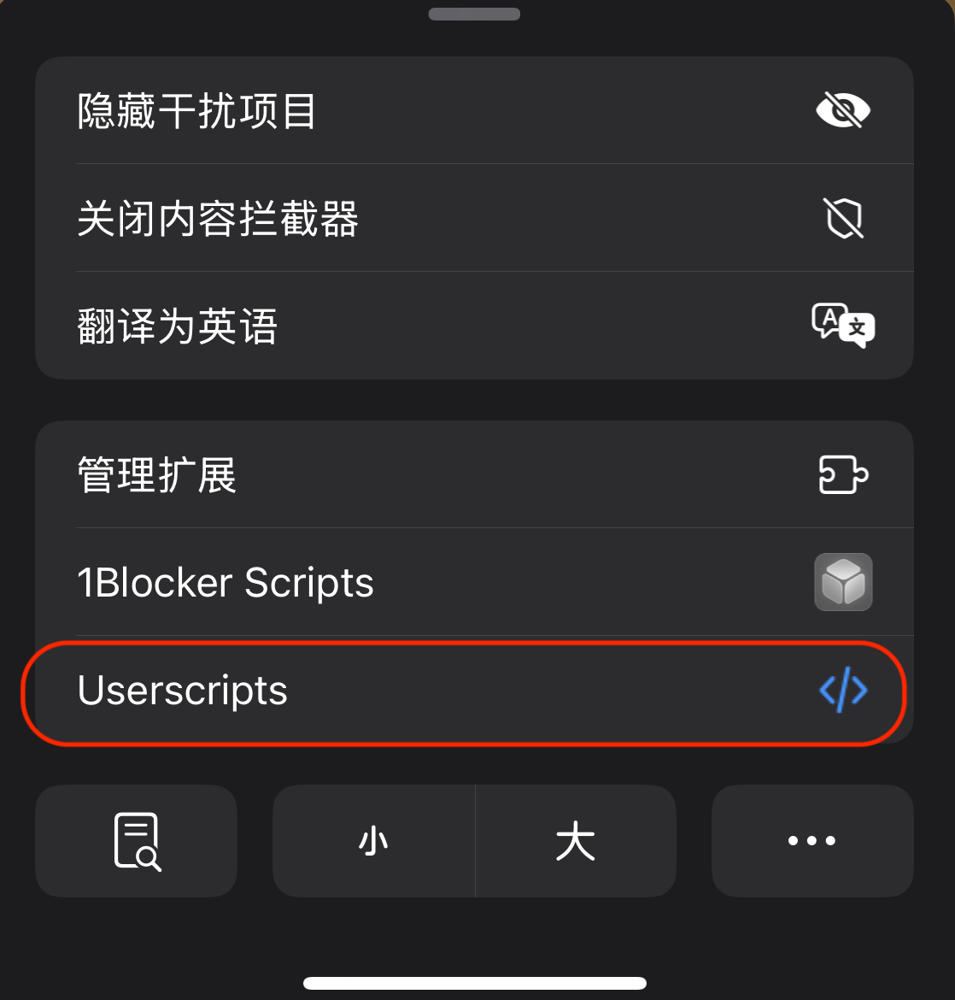
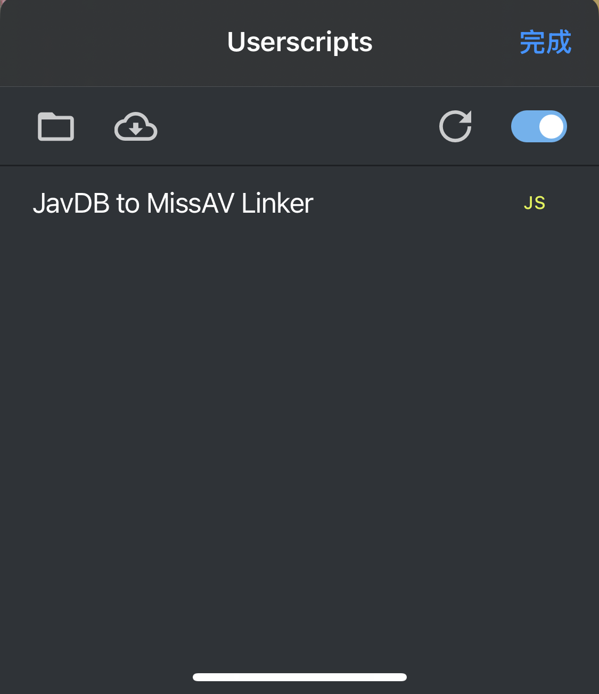
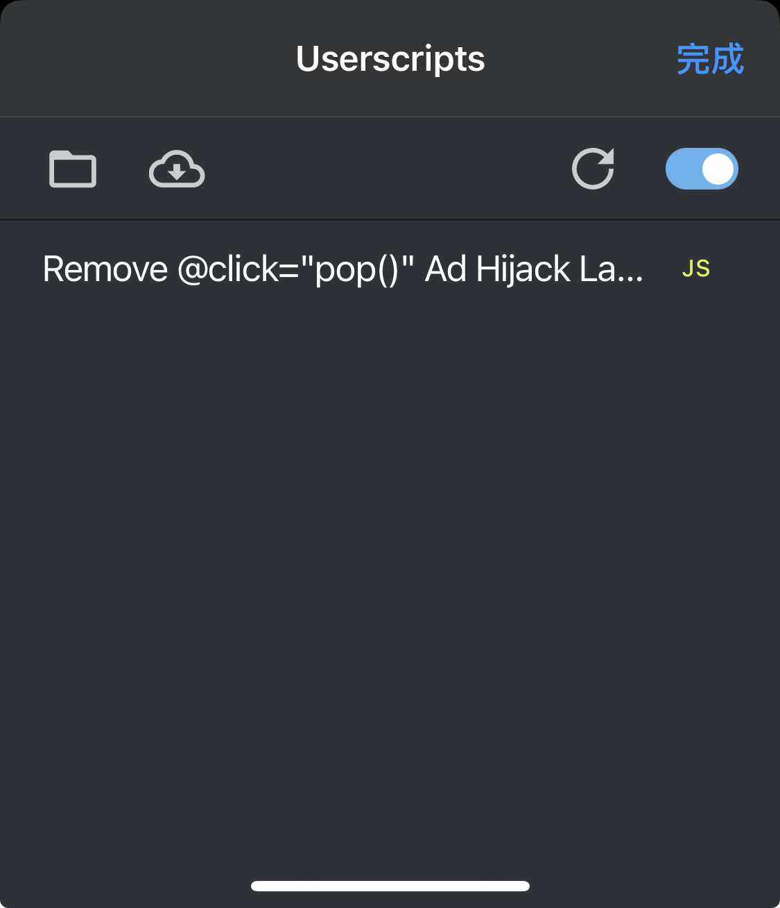

# jav-play-go

在移动设备浏览器上，直接从 javdb 中的影片详情页跳转到 missav 对应的播放页面，并 **免除广告** 直接播放。

## 主要功能

### Userscripts/JavdbJump2Missav.js
1. 在 javdb.com 的影片详情页的右下角添加一个 `MissAV` 按钮
2. 点击这个按钮跳转到 missav.ws 中对应影片的播放页

### Userscripts/RemoveMissavPop.js
1. 移除 missav.ws 中影片播放按钮上覆盖的广告，点击播放按钮直接播放影片

## 使用说明

### iOS (推荐 Safari)

1. 安装 [Userscripts](https://itunes.apple.com/us/app/userscripts/id1463298887)，打开 Userscripts，设置一个存放脚本文件的目录
2. 下载本项目 `/Userscripts` 文件夹中的两个脚本文件，放到设置的文件夹中
3. 打开 Safari，进入 javdb.com 中随意一个影片详情页（最好是旧一点的影片，以防 missav 中还没有这个影片），查看左下角的拼图图标，点开图标看 Userscripts，查看对应的脚本是否生效

4. 脚本生效后 javdb.com 影片详情页面右下角会有一个粉色的 `MissAV` 按钮，点击这个按钮进入 missav.ws 对应的播放页面
5. 同样检查这个页面的脚本是否生效，如果脚本生效，点击播放按钮影片会立即开始播放，而不会跳到广告页面 

#### 进阶优化（可选，推荐）

由于 javdb.com 和 missav.ws 网站上本身有大量广告，影响体验，要达到最终效果，推荐去掉所有广告

1. 安装 [1Blocker](https://1blocker.com/)，按照操作提示开启广告拦截，即可屏蔽掉绝大多数广告
2. 1Blocker -> 自定义规则 -> 拦截元素 -> 新规则 -> 填入以下 CSS 选择器：`.app-desktop-banner,.subheader,.top-meta,#footer` 可以让 javdb.com 在移动端显示效果更好

## 使用效果

[点击链接查看录屏](assets/ScreenRecording_06-08-2025_22-40-06_compressed.mp4)
